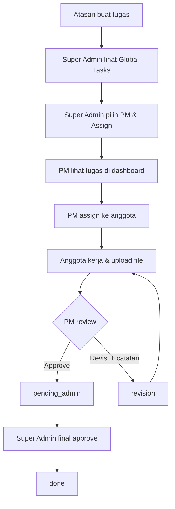

# BUSINESS REQUIREMENT DOCUMENT (BRD) - REVISI FINAL
## Collaborative Task Management System (3-Level Hierarchy)

---

**Versi:** 8.0 (Atasan → Super Admin → PM → Member)
**Tanggal:** 21 Juni 2026
**Status:** Final untuk Stakeholder

---

## 1. Ringkasan Eksekutif

Dokumen ini menguraikan persyaratan untuk pengembangan aplikasi kolaborasi tim untuk tim kecil (3-10 orang). Sistem memiliki hierarki 3-level: **Atasan → Super Admin → Project Manager → Anggota**.

Empat pilar utama:
1. **Atasan** — membuat tugas dan mengirim ke Super Admin.
2. **Super Admin** — menerima tugas dari Atasan, menunjuk Project Manager, final approval.
3. **Project Manager** — mengelola tugas tim, meninjau hasil kerja anggota.
4. **Anggota** — mengerjakan tugas, mengunggah hasil, menerima revisi.

---

## 2. Latar Belakang dan Justifikasi Bisnis

- **Konteks:** Organisasi dengan atasan yang memberi arahan ke super admin, lalu didistribusikan ke PM dan anggota.
- **Permasalahan:** Tidak ada pemisahan antara pembuat tugas (Atasan) dan distributor tugas (Super Admin).
- **Solusi:** Hierarki 3-level dengan alur Atasan → Super Admin → PM → Anggota.

---

## 3. Tujuan Bisnis

- Alur tugas terstruktur 3-level (Atasan → Admin → PM → Anggota).
- Visibilitas penuh bagi Atasan terhadap tugas yang sudah diberikan.
- Akuntabilitas setiap role dalam siklus tugas.
- Sidebar navigasi khusus per role.

---

## 4. Ruang Lingkup

**A. Modul Atasan:**
- Membuat tugas dan mengirim ke Super Admin.
- Melihat status tugas (Sudah Diberikan/Belum Diberikan/Selesai).

**B. Modul Super Admin:**
- Melihat tugas dari Atasan di Global Tasks.
- Menunjuk PM untuk tugas dari Atasan.
- Persetujuan final tugas yang sudah direview PM.
- Manajemen akun pengguna.

**C. Modul Project Manager:**
- Menerima tugas dari Super Admin.
- Menugaskan tugas ke anggota tim.
- Mereview hasil kerja anggota (approve/reject).

**D. Modul Anggota:**
- Melihat tugas yang ditugaskan.
- Mengerjakan dan mengunggah hasil (file).
- Menerima revisi dari PM.

---

## 5. Stakeholders dan Pengguna

| Stakeholder | Peran |
|-------------|-------|
| **Atasan** | Membuat tugas, memantau distribusi. |
| **Super Admin** | Menerima tugas, menunjuk PM, final approval. |
| **Project Manager** | Mengelola tim, menugaskan & mereview tugas anggota. |
| **Anggota** | Mengerjakan tugas, upload hasil, menerima revisi. |

---

## 6. Persyaratan Fungsional

| Kode | Kebutuhan | Prioritas |
|------|-----------|-----------|
| F-01 | Atasan dapat membuat tugas dan mengirim ke Super Admin. | Wajib |
| F-02 | Super Admin melihat tugas dari Atasan di Global Tasks. | Wajib |
| F-03 | Super Admin dapat menunjuk PM untuk tugas dari Atasan. | Wajib |
| F-04 | Saat memilih PM, muncul tim yang dipimpin. | Wajib |
| F-05 | PM dapat menugaskan tugas ke anggota tim. | Wajib |
| F-06 | Anggota dapat mengerjakan dan mengupload file. | Wajib |
| F-07 | PM dapat approve tugas anggota → pending admin. | Wajib |
| F-08 | PM dapat reject tugas anggota → revision. | Wajib |
| F-09 | Super Admin dapat final approve → done. | Wajib |
| F-10 | Setiap role memiliki sidebar dengan navigasi. | Wajib |
| F-11 | Status Global Tasks: Sudah Diberikan / Belum Diberikan. | Wajib |

---

## 7. Use Case Bisnis

| ID | Use Case | Aktor | Deskripsi Bisnis | Trigger | Hasil Sukses |
|----|----------|-------|------------------|---------|--------------|
| UC-01 | Membuat Tugas Baru | Atasan | Atasan mengisi form tugas (judul, deskripsi, prioritas, deadline) dan mengirimnya ke Super Admin untuk didistribusikan. | Atasan memiliki pekerjaan yang perlu dikerjakan tim. | Tugas masuk ke antrian Global Tasks Super Admin. |
| UC-02 | Mendistribusikan Tugas | Super Admin | Super Admin melihat tugas dari Atasan di Global Tasks, lalu menunjuk PM yang sesuai beserta timnya. | Ada tugas baru dari Atasan yang belum memiliki PM. | Tugas terdistribusi ke PM dan tim yang tepat. |
| UC-03 | Menugaskan Anggota Tim | PM | PM menerima tugas dari Super Admin dan menugaskannya ke anggota tim tertentu untuk dikerjakan. | PM mendapat tugas baru dari Super Admin. | Anggota tim menerima tugas dan mulai mengerjakan. |
| UC-04 | Mengerjakan & Menyerahkan Tugas | Anggota | Anggota mengerjakan tugas, mengunggah file hasil kerja, dan mengirimkannya ke PM untuk direview. | Anggota menyelesaikan pekerjaannya. | Hasil kerja masuk ke antrian review PM. |
| UC-05 | Mereview Hasil Kerja | PM | PM memeriksa hasil kerja anggota. Jika sesuai, approve (lanjut ke Super Admin). Jika perlu perbaikan, reject dengan catatan revisi. | Ada hasil kerja yang menunggu review. | Tugas lanjut ke final approval Super Admin atau dikembalikan ke anggota untuk revisi. |
| UC-06 | Finalisasi Tugas | Super Admin | Super Admin melakukan persetujuan akhir untuk tugas yang sudah di-review PM, menandai tugas sebagai selesai. | Ada tugas yang sudah di-approve PM. | Tugas resmi selesai dan tercatat dalam sistem. |
| UC-07 | Memantau Kinerja PM | Super Admin | Super Admin melihat dashboard metrik kinerja PM (total tugas, selesai, overdue, completion rate) untuk evaluasi. | Super Admin perlu mengevaluasi performa PM. | Data kinerja PM tersaji dalam bentuk tabel/metrik. |
| UC-08 | Menghubungi Tim | Super Admin | Super Admin mengirim pesan (email/WhatsApp) ke PM atau anggota tim untuk koordinasi. | Super Admin perlu berkomunikasi dengan tim. | Pesan terkirim ke penerima. |

---

## 8. Alur Proses Bisnis

1. **Atasan** buka Buat Tugas → isi form → Kirim → tugas masuk ke Global Tasks Super Admin.
2. **Super Admin** lihat Global Tasks → klik Detail → pilih PM → Assign.
3. **PM** lihat tugas baru di dashboard → klik "Assign" → pilih anggota → anggota kerja.
4. **Anggota** kerja → klik "Selesai & Upload" → upload file → status `pending_pm`.
5. **PM** review → **Approve** (→ `pending_admin`) atau **Revisi** + catatan (→ `revision`).
6. **Super Admin** lihat tugas `pending_admin` → klik "Selesai" → `done`.

---

## 9. Teknologi

- **Framework:** Laravel Fullstack (Blade + Livewire).
- **Database:** MariaDB.
- **Frontend:** Tailwind CSS, Alpine.js.
- **Autentikasi:** Session-based (Laravel Breeze).
- **Layout:** Sidebar per role (atasan, admin, pm, member).
- **Notifikasi:** WhatsApp via Fonnte API (token di `.env`), Email via SMTP.
- **Kolom `phone`:** Sudah ada di tabel `users` (nullable, max 20 char). User isi sendiri via halaman profil.

> **Catatan:** `FONNTE_TOKEN` sudah diisi di `.env`. Config (`config/fonnte.php`) siap digunakan. User bisa isi nomor WA sendiri di halaman profil untuk mengaktifkan notifikasi WhatsApp.

---

## 10. Kriteria Penerimaan

| No | Kriteria | Status |
|----|----------|--------|
| 1 | Atasan buat tugas, masuk ke Global Tasks Admin | ✅ |
| 2 | Super Admin assign tugas dari Atasan ke PM | ✅ |
| 3 | PM assign tugas ke anggota | ✅ |
| 4 | Anggota upload file + submit | ✅ |
| 5 | PM approve → pending_admin | ✅ |
| 6 | PM reject + catatan → revision | ✅ |
| 7 | Super Admin final approve → done | ✅ |
| 9 | Hubungi Team via modal popup | ✅ |
| 10 | PM Performance metrics dashboard | ⏳ |
| 11 | Notifikasi WhatsApp otomatis + manual | ✅ |
| 12 | Notifikasi Email via compose form | ✅ |
